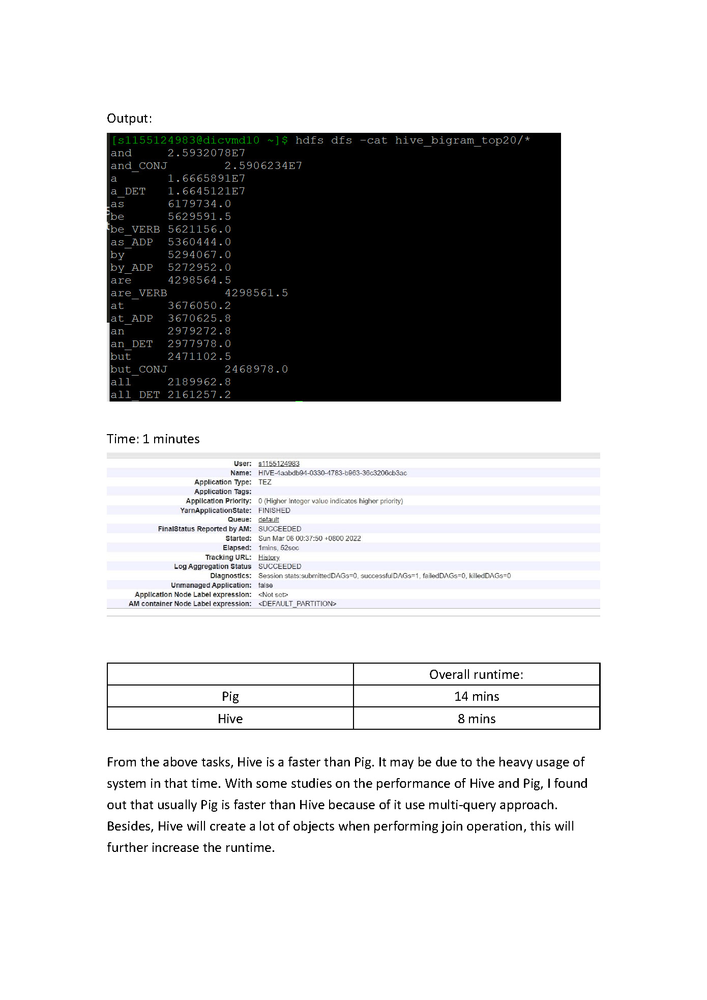

# Big-Data-Systems
Hadoop, K8s, Pig and Hive, Spark, Kafka, GraphFrames, GraphX, HBase and SparkML

T1: Set up a Kubernetes cluster and run Hadoop MapReduce programs on top of it.

T2: Basic Operations of Pig, Basic Operations of Hive, Similar Users Detection in the MovieLens Dataset using Pig

T3: Spark Basic RDD, Spark SQL, Setup and run a Spark application over Kubernetes, Fault tolerance mechanisms for Spark over Kubernetes

T4: Multi-node Kafka Cluster Setup, Setup Kafka Cluster over Kubernetes, Count the Most Frequent Hashtags with Spark RDD Streaming, Spark Structured Streaming

T5: GraphFrames, GraphX, HBase, Spark ML

# Task1: Hadoop over Kubernetes

# Task2: Pig and Hive

# Task3: Spark

# Task4: Kafka

# Task5: GraphFrames, GraphX, HBase and SparkML

